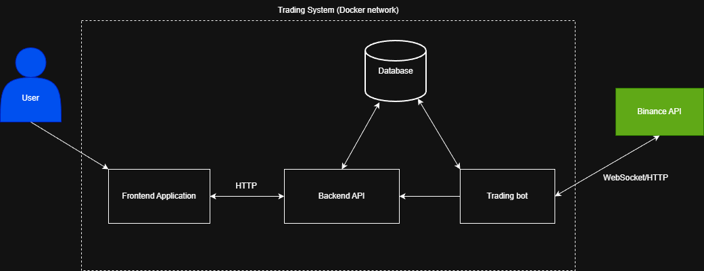
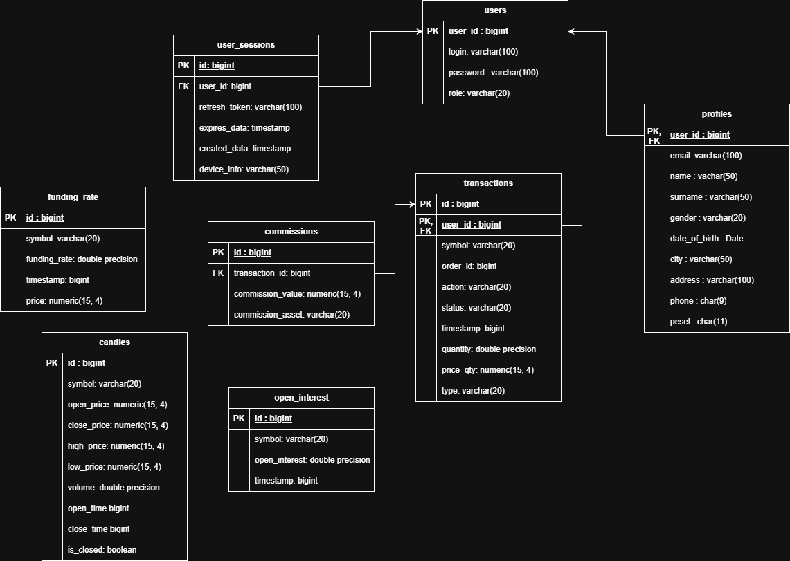

# trading-system

A full-stack web application featuring an integrated trading bot that analyzes real-time Binance market data to make automated trading decisions on behalf of users.

## System architecture

Application is divided into three microservices:

- **Frontend** - a responsive web application serving as the user interface. It provides a dashboard for real-time visualization of market data, portfolio performance, and trade history. It communicates with the Backend via REST API for configuration (cold data) and WebSockets for live execution alerts (hot data)
- **Backend** - the core management layer and API Gateway built with Spring Boot. It handles user authentication, secures the PostgreSQL database, and bridges communication between the user and the bot. It routes control commands to the bot and pushes live trading updates back to the frontend.
- **Trading-bot** - an isolated, highly optimized worker module. It maintains persistent WebSocket connections with the Binance API, parsing live market data (Candles, Open Interest, Funding Rates). It autonomously executes algorithmic trading strategies and processes order fills in real-time, completely decoupled from user-facing web traffic.



## Authentication

This project implements a robust, stateless authentication system using **JSON Web Tokens** and **HttpOnly Cookies**, adhering to modern web security best practices.

### Key Security Features

- **Dual-Token Architecture:**
  - **Access Token:** A short-lived JWT returned in the response body. It contains user claims (roles, ID) and is used to authorize requests via the `Authorization: Bearer <token>` header.
  - **Refresh Token:** A long-lived, securely generated UUID. To mitigate XSS (Cross-Site Scripting) attacks, it is issued exclusively as an `HttpOnly`, `Secure`, and `SameSite=Strict` cookie.
- **Database Security:** The database never stores raw Refresh Tokens. It only stores their **SHA-256** hashes to prevent token hijacking in case of a database breach.
- **Password Hashing:** User passwords are encrypted using the **BCrypt** algorithm before persisting to the database.
- **Stateless Sessions:** The Spring Security configuration is entirely stateless, eliminating the need for server-side sessions (`JSESSIONID`), making the API highly scalable.
- **Custom Security Filters:** A custom `JwtAuthenticationFilter` intercepts incoming requests, validates the token's cryptographic signature, and sets the Spring Security Context without querying the database.

## Trading bot module

The Trading Bot is the core algorithmic engine of the application. Designed as an isolated, headless microservice, it should operate 24/7 to monitor the cryptocurrency market, evaluate trading strategies, and execute orders autonomously. By decoupling the bot from the user-facing web traffic, the system ensures zero-latency trade execution and high fault tolerance.

### Core Responsibilities

- **Real-Time Data Ingestion:** maintains persistent WebSocket connections to the Binance API, continuously streaming live market data including Candles, Open Interest, and Funding Rates.

- **Smart Data Routing:** utilizes an internal MarketDataRouter to parse raw JSON payloads and dispatch them to specialized domain services (e.g., CandleService, FuturesDataService) to prevent bottlenecking.

- **Automated Decision Engine:** evaluates technical indicators, price action, and futures market sentiment to generate mathematically based TradeSignalEvents - work in progress.

- Work in progress: connection to Redis server so as to communicate with primary Backend API.

## Database

There is one central PostgreSQL database for the whole system, initialized and managed with the Flyway framework, because it provides robust version control for the database schema. This ensures that every deployment environment remains perfectly synchronized with the application code, automating the execution of SQL migrations and preventing structural mismatches.

- **Single Source of Truth:** using a unified database simplifies backups, reduces infrastructure overhead, and allows for strict relational integrity e.g., linking user configurations from the Backend directly to the Trading Bot's order history.

- **Flyway Migrations:** all database changes (creating tables, altering columns) are written as sequential SQL scripts (V1**init_schema.sql, V2**create_users_table.sql). Flyway automatically tracks which scripts have been executed, making deployments 100% predictable and reproducible.

- **Domain Separation:** although physically one database, the tables are logically grouped by domain (User Management, Market Data, Trade History) to prevent the application from becoming a monolithic bottleneck.



## Initialize environment and run application (for developers)

1. Generate the Bincance API keys to connect to the market and save it in trading-bot/.env
2. Save database credentials into your .env file.
3. In order to run the trading-bot microservice:

```
cd trading-bot
mvnw spring-boot:run
```

4. In order to run backend microservice:

```
cd backend
mvnw spring-boot:run
```

5. In order to run frontend service:

```
cd frontend
npm run dev
```
